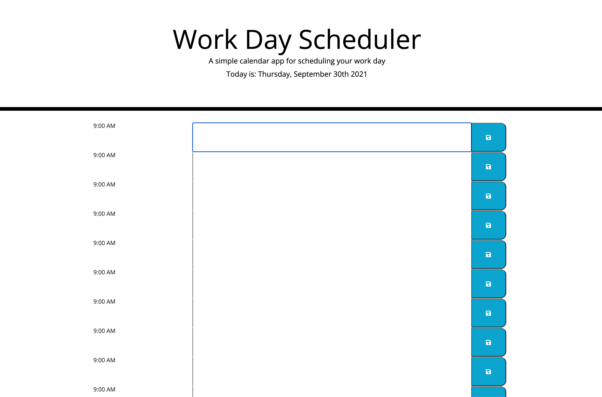

# work-day-scheduler
Boot Camp HW #5

## Project Description
- User can add hourly events to a work day planner and save (to local storage) so that the events persist even upon page refresh.
- When the page opens, the current day is displayed at the top of the calender (in the header).
- Scrolling down shows timeblocks for standard business hours.
- Each timeblock is color coded to indicate whether or not the event is past, present, or future.

## Screenshots

## Website link
https://cleadi.github.io/work-day-scheduler/